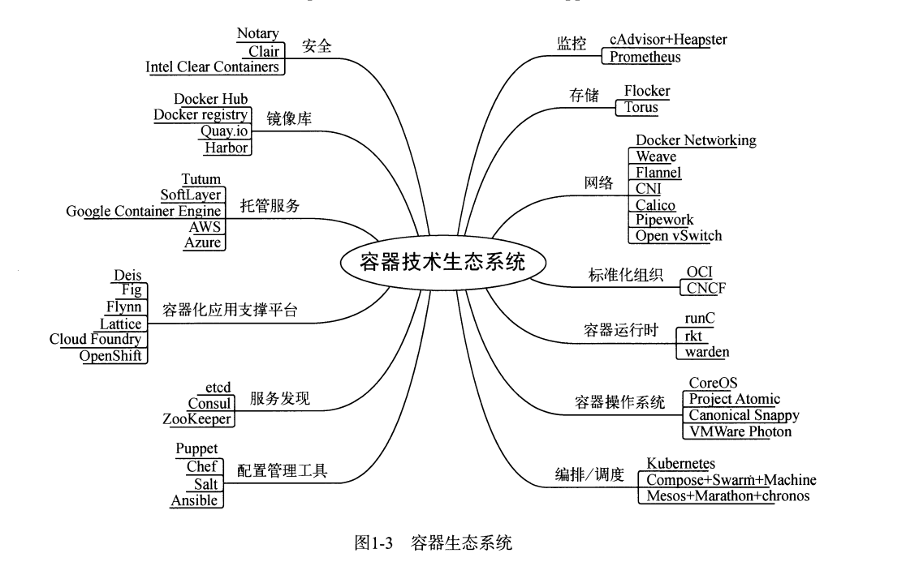

# DockerPrimer

## 容器技术生态




## CentOS 安装 Docker

### 系统要求

Docker 支持 64 位版本 CentOS 7/8，并且要求内核版本不低于 3.10。 CentOS 7 满足最低内核的要求，但由于内核版本比较低，部分功能（如 `overlay2` 存储层驱动）无法使用，并且部分功能可能不太稳定

### 卸载旧版本

旧版本的 Docker 称为 `docker` 或者 `docker-engine`，使用以下命令卸载旧版本：

```
sudo yum remove docker \
                  docker-client \
                  docker-client-latest \
                  docker-common \
                  docker-latest \
                  docker-latest-logrotate \
                  docker-logrotate \
                  docker-selinux \
                  docker-engine-selinux \
                  docker-engine
```

### 安装方式1：使用 yum 安装

```
sudo yum install -y yum-utils
```

鉴于国内网络问题，强烈建议使用国内源

```
sudo yum-config-manager \
    --add-repo \
    https://mirrors.aliyun.com/docker-ce/linux/centos/docker-ce.repo

sudo sed -i 's/download.docker.com/mirrors.aliyun.com\/docker-ce/g' /etc/yum.repos.d/docker-ce.repo

# 官方源
# sudo yum-config-manager \
#     --add-repo \
#     https://download.docker.com/linux/centos/docker-ce.repo

```

更新 `yum` 软件源缓存，并安装 `docker-ce`

```
yum clean all
yum makecache
sudo yum install docker-ce docker-ce-cli containerd.io docker-compose-plugin
```

### 安装方式2：使用脚本自动安装

在测试或开发环境中 Docker 官方为了简化安装流程，提供了一套便捷的安装脚本，CentOS 系统上可以使用这套脚本安装，另外可以通过 `--mirror` 选项使用国内源进行安装

```
$ curl -fsSL get.docker.com -o get-docker.sh
$ sudo sh get-docker.sh --mirror Aliyun
```


### 启动docker
```
sudo systemctl enable docker
sudo systemctl start docker
```

### 建立 `docker` 组
默认情况下，`docker` 命令会使用 [Unix socket](https://en.wikipedia.org/wiki/Unix_domain_socket) 与 Docker 引擎通讯。而只有 `root` 用户和 `docker` 组的用户才可以访问 Docker 引擎的 Unix socket。出于安全考虑，一般 Linux 系统上不会直接使用 `root` 用户。因此，更好地做法是将需要使用 `docker` 的用户加入 `docker` 用户组
```
sudo groupadd docker
sudo usermod -aG docker $USER
```

### 检测是否安装成功
```
docker run --rm hello-world
```

### 镜像加速器

1.查看是否在 `docker.service` 文件中配置过镜像地址

```
systemctl cat docker | grep '\-\-registry\-mirror'
```

如果该命令有输出，那么请执行 `$ systemctl cat docker` 查看 `ExecStart=` 出现的位置，修改对应的文件内容去掉 `--registry-mirror` 参数及其值

2.修改 /etc/docker/daemon.json

```
sudo vim /etc/docker/daemon.json

#添加
{
  "registry-mirrors": [
    "https://hub-mirror.c.163.com",
    "https://mirror.baidubce.com"
  ]
}
```

3.重启服务

```
sudo systemctl daemon-reload
sudo systemctl restart docker
```

4.其他镜像服务

```
腾讯云：
{
  "registry-mirrors": [
    "https://mirror.ccs.tencentyun.com“
  ]
}
```

## 镜像
### 获取镜像
#### 拉去镜像
```
# docker pull [选项] [Docker Registry 地址[:端口号]/]仓库名[:标签]
docker pull ubuntu:18.04
```
#### 运行镜像
```
docker run ubuntu:18.04
```

###  docker commit定制镜像
镜像是容器的基础，每次执行`docker run`的时候都会指定哪个镜像作为容器运行的基础。在之前的例子中，我们所使用的都是来自于 Docker Hub 的镜像。直接使用这些镜像是可以满足一定的需求，而当这些镜像无法直接满足需求时，我们就需要定制这些镜像
#### 以定制一个 Web 服务器为例子
- 用 nginx 镜像启动一个容器，命名为 webserver,并且映射了 80 端口,用浏览器去访问这个 nginx 服务器
```
docker run --name webserver -d -p 80:80 nginx
```
- 使用 docker exec命令进入容器，修改其内容,再刷新浏览器的话，会发现内容被改变了
```
docker exec -it webserver bash
root@3729b97e8226:/# echo '<h1>Hello, Docker!</h1>' > /usr/share/nginx/html/index.html
root@3729b97e8226:/# exit
```

- 使用Docker commit 将容器的存储层保存下来成为镜像
```
docker commit \
    --author "ww" \
    --message "修改了默认首页" \
    webserver \
    nginx:v2
```

- 新的镜像定制好后，我们可以来运行这个镜像
```
docker run --name webserv2 -d -p 81:80 nginx:v2
```


### 使用 Dockerfile 定制镜像
可以把每一层修改、安装、构建、操作的命令都写入一个脚本，用这个脚本来构建、定制镜像。Dockerfile 是一个文本文件，其内包含了一条条的指令(Instruction)，每一条指令构建一层，因此每一条指令的内容，就是描述该层应当如何构建。
以之前定制 nginx 镜像为例，这次我们使用 Dockerfile 来定制。在一个空白目录中，建立一个文本文件，并命名为 Dockerfile
```
mkdir mynginx
cd mynginx
touch Dockerfile
```

Dockerfile 内容
```
FROM nginx
RUN echo '<h1>Hello, Docker!</h1>' > /usr/share/nginx/html/index.html
```

#### FROM 指定基础镜像
以一个镜像为基础，在其上进行定制.`FROM`就是指定基础镜像，因此一个 Dockerfile 中 FROM 是必备的指令，并且必须是第一条指令。
除了选择现有镜像为基础镜像外，Docker 还存在一个特殊的镜像，名为`scratch`。这个镜像是虚拟的概念，并不实际存在，它表示一个空白的镜像。
如果你以`scratch`为基础镜像的话，意味着你不以任何镜像为基础，接下来所写的指令将作为镜像第一层开始存在。有的同学可能感觉很奇怪，没有任何基础镜像，我怎么去执行我的程序呢，其实对于 Linux 下静态编译的程序来说，并不需要有操作系统提供运行时支持，所需的一切库都已经在可执行文件里了，因此直接`FROM scratch`会让镜像体积更加小巧。使用 Go 语言 开发的应用很多会使用这种方式来制作镜像，这也是为什么有人认为 Go 是特别适合容器微服务架构的语言的原因之一。

#### RUN 执行命令
`RUN`指令是用来执行命令行命令的。由于命令行的强大能力，`RUN`指令在定制镜像时是最常用的指令之一。其格式有两种：
- shell 格式：RUN <命令>，就像直接在命令行中输入的命令一样。刚才写的 Dockerfile 中的 RUN 指令就是这种格式。
```
RUN echo '<h1>Hello, Docker!</h1>' > /usr/share/nginx/html/index.html
```
- exec 格式：RUN ["可执行文件", "参数1", "参数2"]，这更像是函数调用中的格式。 既然 RUN 就像 Shell 脚本一样可以执行命令，那么我们是否就可以像 Shell 脚本一样把每个命令对应一个 RUN 呢？比如这样：
```
FROM debian:jessie
RUN apt-get update
RUN apt-get install -y gcc libc6-dev make
RUN wget -O redis.tar.gz "http://download.redis.io/releases/redis-3.2.5.tar.gz"
RUN mkdir -p /usr/src/redis
RUN tar -xzf redis.tar.gz -C /usr/src/redis --strip-components=1
RUN make -C /usr/src/redis
RUN make -C /usr/src/redis install
```
之前说过，Dockerfile 中每一个指令都会建立一层，RUN 也不例外。每一个 RUN 的行为，就和刚才我们手工建立镜像的过程一样：新建立一层，在其上执行这些命令，执行结束后，commit 这一层的修改，构成新的镜像。
而上面的这种写法，创建了 7 层镜像。这是完全没有意义的，而且很多运行时不需要的东西，都被装进了镜像里，比如编译环境、更新的软件包等等。结果就是产生非常臃肿、非常多层的镜像，不仅仅增加了构建部署的时间，也很容易出错。 这是很多初学 Docker 的人常犯的一个错误。
上面的 Dockerfile 正确的写法应该是这样：
```
FROM debian:jessie
RUN buildDeps='gcc libc6-dev make' \
    && apt-get update \
    && apt-get install -y $buildDeps \
    && wget -O redis.tar.gz "http://download.redis.io/releases/redis-3.2.5.tar.gz" \
    && mkdir -p /usr/src/redis \
    && tar -xzf redis.tar.gz -C /usr/src/redis --strip-components=1 \
    && make -C /usr/src/redis \
    && make -C /usr/src/redis install \
    && rm -rf /var/lib/apt/lists/* \
    && rm redis.tar.gz \
    && rm -r /usr/src/redis \
    && apt-get purge -y --auto-remove $buildDeps
```

#### 构建镜像
在 Dockerfile 文件所在目录执行
```
docker build -t nginx:v3 .
```
#### 镜像构建上下文（Context）
 docker build 命令最后有一个`.`。`.`表示当前目录，而 Dockerfile 就在当前目录，因此不少初学者以为这个路径是在指定 Dockerfile 所在路径，这么理解其实是不准确的。如果对应上面的命令格式，你可能会发现，这是在指定上下文路径.
 docker build 的工作原理。Docker 在运行时分为 Docker 引擎（也就是服务端守护进程）和客户端工具。Docker 的引擎提供了一组 REST API，被称为 Docker Remote API，而如 docker 命令这样的客户端工具，则是通过这组 API 与 Docker 引擎交互，从而完成各种功能。因此，虽然表面上我们好像是在本机执行各种 docker 功能，但实际上，一切都是使用的远程调用形式在服务端（Docker 引擎）完成。也因为这种 C/S 设计，让我们操作远程服务器的 Docker 引擎变得轻而易举。
 当我们进行镜像构建的时候，并非所有定制都会通过 RUN 指令完成，经常会需要将一些本地文件复制进镜像，比如通过 COPY 指令、ADD 指令等。而 docker build 命令构建镜像，其实并非在本地构建，而是在服务端，也就是 Docker 引擎中构建的。那么在这种客户端/服务端的架构中，如何才能让服务端获得本地文件呢？
这就引入了上下文的概念。当构建的时候，用户会指定构建镜像上下文的路径，docker build 命令得知这个路径后，会将路径下的所有内容打包，然后上传给 Docker 引擎。这样 Docker 引擎收到这个上下文包后，展开就会获得构建镜像所需的一切文件。
如果在 Dockerfile 中这么写：
```
COPY ./package.json /app/
```
这并不是要复制执行 docker build 命令所在的目录下的 package.json，也不是复制 Dockerfile 所在目录下的 package.json，而是复制 上下文（context） 目录下的 package.json。

###  私有镜像仓库
#### Docker Hub
目前 Docker 官方维护了一个公共仓库`Docker Hub`
#### 私有仓库
`docker-registry`是官方提供的工具，可以用于构建私有的镜像仓库
```
sudo docker run -d -p 5000:5000 --restart=always --name registry registry
```

默认情况下，仓库会被创建在容器的`/var/lib/registry`目录下。你可以通过 -v 参数来将镜像文件存放在本地的指定路径
```
sudo docker run -d \
    -p 5000:5000 \
    -v /opt/data/registry:/var/lib/registry \
    registry
```
#####  在私有仓库上传、搜索、下载镜像
创建好私有仓库之后，就可以使用`docker tag`来标记一个镜像，然后推送它到仓库。先在本机查看已有的镜像
```
sudo docker image ls
```
使用docker tag 为镜像打标签， 格式为 docker tag IMAGE[:TAG] [REGISTRY_HOST[:REGISTRY_PORT]/]REPOSITORY[:TAG]
```
$ sudo docker tag nginx:v3 127.0.0.1:5000/nginx:v3
$ sudo docker image ls
REPOSITORY             TAG       IMAGE ID       CREATED        SIZE
127.0.0.1:5000/nginx   v3        373a3ce2efb9   21 hours ago   142MB
```
使用`docker push`上传标记的镜像
```
sudo docker push 127.0.0.1:5000/nginx:v3
```
用`curl`查看仓库中的镜像
```
$ curl 127.0.0.1:5000/v2/_catalog
{"repositories":["nginx"]}
```
运行私库中的镜像
```
sudo docker run --name webserv3 -d -p 83:80 127.0.0.1:5000/nginx:v3
```
####  注意事项
 Docker 默认不允许非 HTTPS 方式推送镜像。我们可以通过 Docker 的配置选项来取消这个限制，对于使用 systemd 的系统（centos7为例），请在`/etc/docker/daemon.json`中写入如下内容（如果文件不存在请新建该文件）
 ```
{
  "registry-mirror": [
    "https://registry.docker-cn.com"
  ],
  "insecure-registries": [
    "192.168.199.100:5000"
  ]
}
```


## 操作容器
### 启动 
```
#docker run
docker run ubuntu:18.04

#docker run -it --rm ubuntu:16.04 /bin/bash
#-it：这是两个参数，一个是 -i：交互式操作，一个是 -t 终端。我们这里打算进入 bash 执行一些命令并查看返回结果，因此我们需要交互式终端
#--rm：这个参数是说容器退出后随之将其删除。默认情况下，为了排障需求，退出的容器并不会立即删除，除非手动 docker rm。

#-d 后台运行
docker run -d ubuntu:18.04
```
当利用 `docker run` 来创建容器时，Docker 在后台运行的标准操作包括：

-   检查本地是否存在指定的镜像，不存在就从 [registry](/docker_practice/repository) 下载
-   利用镜像创建并启动一个容器
-   分配一个文件系统，并在只读的镜像层外面挂载一层可读写层
-   从宿主主机配置的网桥接口中桥接一个虚拟接口到容器中去
-   从地址池配置一个 ip 地址给容器
-   执行用户指定的应用程序
-   执行完毕后容器被终止

### 终止
```
#docker container stop
#docker container start
#docker container restart
```
### 进入容器
在使用`-d`参数时，容器启动后会进入后台。某些时候需要进入容器进行操作：**exec 命令 -i -t 参数**，如果从这个 stdin 中 exit，不会导致容器的停止
```
sudo docker exec -it 571e bash
```
### 删除容器
```
#删除一个处于终止状态的容器
docker container rm [name]
#自动清理终止的容器
docker container prune 
```


## 数据管理
### 数据卷
`数据卷` 是一个可供一个或多个容器使用的特殊目录，它绕过 UFS，可以提供很多有用的特性：
-   `数据卷` 可以在容器之间共享和重用
-   对 `数据卷` 的修改会立马生效
-   对 `数据卷` 的更新，不会影响镜像
-   `数据卷` 默认会一直存在，即使容器被删除

> 注意：`数据卷` 的使用，类似于 Linux 下对目录或文件进行 mount，镜像中的被指定为挂载点的目录中的文件会复制到数据卷中（仅数据卷为空时会复制）。

#### 创建一个数据卷
```
#创建
sudo docker volume create my-vol

#查看所有的数据卷
sudo docker volume ls

#查看指定 `数据卷` 的信息
sudo docker volume inspect my-vol
```

#### 启动一个挂载数据卷的容器
在用 `docker run` 命令的时候，使用 `--mount` 标记来将 `数据卷` 挂载到容器里。在一次 `docker run` 中可以挂载多个 `数据卷`。
下面创建一个名为 `web` 的容器，并加载一个 `数据卷` 到容器的 `/usr/share/nginx/html` 目录
```
sudo docker run -d -P \
    --name web \
    --mount source=my-vol,target=/usr/share/nginx/html \
    nginx:alpine
```

#### 查看数据卷的具体信息
```
docker inspect web
```

#### 删除数据卷
```
#删除指定的数据卷
docker volume rm my-vol

#清理无主的数据卷
sudo docker volume prune
```

#### 挂载主机目录
使用 `--mount` 标记可以指定挂载一个本地主机的目录到容器中去
```
#加载主机的 `/src/webapp` 目录到容器的 `/usr/share/nginx/html`目录

docker run -d -P \
--name web \
--mount type=bind,source=/src/webapp,target=/usr/share/nginx/html \
nginx:alpine
```

Docker 挂载主机目录的默认权限是 `读写`，用户也可以通过增加 `readonly` 指定为 `只读`
```
docker run -d -P \
--name web \
--mount type=bind,source=/src/webapp,target=/usr/share/nginx/html,readonly \
nginx:alpine
```

#### 查看数据卷的具体信息
```
docker inspect web
```

#### 挂载一个本地主机文件作为数据卷
`--mount` 标记也可以从主机挂载单个文件到容器中
```
docker run --rm -it \
--mount type=bind,source=$HOME/.bash_history,target=/root/.bash_history \
ubuntu:18.04 \
bash
```

## 网络

#### 映射到指定地址的指定端口
可以使用 `ip:hostPort:containerPort` 格式指定映射使用一个特定地址，比如 localhost 地址 127.0.0.1
```
docker run -d -p 127.0.0.1:80:80 nginx:alpine
```
`-p` 标记可以多次使用来绑定多个端口
```
docker run -d \
-p 80:80 \
-p 443:443 \
nginx:alpine
```

#### 查看映射端口配置
使用 `docker port` 来查看当前映射的端口配置，也可以查看到绑定的地址
```
docker port fa 80
```

### 容器互联
将容器加入自定义的 Docker 网络来连接多个容器

#### 新建网络
下面先创建一个新的 Docker 网络
```
docker network create -d bridge my-net
```
`-d` 参数指定 Docker 网络类型，有 `bridge` `overlay`。

#### 连接容器
运行一个容器并连接到新建的 `my-net` 网络
```
docker run -it --rm --name busybox1 --network my-net busybox sh
```
打开新的终端
```
docker run -it --rm --name busybox2 --network my-net busybox sh
```
再打开一个新的终端查看容器信息
```
docker container ls
```
在 `busybox1` 容器输入以下命令,用 ping 来测试连接 `busybox2` 容器
```
ping busybox2
```

### 配置 DNS
Docker 利用虚拟文件来挂载容器的 3 个相关配置文件。在容器中使用 `mount` 命令可以看到挂载信息。这种机制可以让宿主主机 DNS 信息发生更新后，所有 Docker 容器的 DNS 配置通过 `/etc/resolv.conf` 文件立刻得到更新，配置全部容器的 DNS ，也可以在 `/etc/docker/daemon.json` 文件中增加以下内容来设置
```
{
  "dns" : [
    "114.114.114.114",
    "8.8.8.8"
  ]
}
```

## Docker Buildx
**BuildKit** 是下一代的镜像构建组件,该功能仅适用于 Docker v19.03+ 版本

## Docker Compose
`Docker Compose` 是 Docker 官方编排（Orchestration）项目之一，负责快速的部署分布式应用。

### 简介
`Compose` 允许用户通过一个单独的 `docker-compose.yml` 模板文件（YAML 格式）来定义一组相关联的应用容器为一个项目（project）。
`Compose` 中有两个重要的概念：
-   服务 (`service`)：一个应用的容器，实际上可以包括若干运行相同镜像的容器实例。
-   项目 (`project`)：由一组关联的应用容器组成的一个完整业务单元，在 `docker-compose.yml` 文件中定义。
`Compose` 的默认管理对象是项目，通过子命令对项目中的一组容器进行便捷地生命周期管理。

### 安装与卸载
#### linux安装
二进制包方式安装
```
sudo curl -L https://github.com/docker/compose/releases/download/1.27.4/docker-compose-`uname -s`-`uname -m` > /usr/local/bin/docker-compose

#国内
sudo curl -L https://download.fastgit.org/docker/compose/releases/download/1.27.4/docker-compose-`uname -s`-`uname -m` > /usr/local/bin/docker-compose

sudo chmod +x /usr/local/bin/docker-compose

#补全命令
curl -L https://raw.githubusercontent.com/docker/compose/1.27.4/contrib/completion/bash/docker-compose > /etc/bash_completion.d/docker-compose
```

####  linux卸载
二进制包方式安装的，删除二进制文件即可
```
sudo rm /usr/local/bin/docker-compose
```

### 命令说明
#### up
默认情况，`docker-compose up` 启动的容器都在前台，控制台将会同时打印所有容器的输出信息，可以很方便进行调试
如果使用 `docker-compose up -d`，将会在后台启动并运行所有的容器。一般推荐生产环境下使用该选项。

### Compose 模板文件
默认的模板文件名称为 `docker-compose.yml`
```
version: "3"

services:
  webapp:
    image: examples/web
    ports:
      - "80:80"
    volumes:
      - "/data"
```


## 安全
评估 Docker 的安全性时，主要考虑三个方面:
-   由内核的命名空间和控制组机制提供的容器内在安全
-   Docker 程序（特别是服务端）本身的抗攻击性
-   内核安全性的加强机制对容器安全性的影响

### 服务端防护
运行一个容器或应用程序的核心是通过 Docker 服务端。Docker 服务的运行目前需要 root 权限，因此其安全性十分关键。

### 内核能力机制

能力机制（Capability）是 Linux 内核一个强大的特性，可以提供细粒度的权限访问控制。默认情况下，Docker 启动的容器被严格限制只允许使用内核的一部分能力。
使用能力机制对加强 Docker 容器的安全有很多好处。通常，在服务器上会运行一堆需要特权权限的进程，包括有 ssh、cron、syslogd、硬件管理工具模块（例如负载模块）、网络配置工具等等。容器跟这些进程是不同的，因为几乎所有的特权进程都由容器以外的支持系统来进行管理。
-   ssh 访问被主机上ssh服务来管理；
-   cron 通常应该作为用户进程执行，权限交给使用它服务的应用来处理；
-   日志系统可由 Docker 或第三方服务管理；
-   硬件管理无关紧要，容器中也就无需执行 udevd 以及类似服务；
-   网络管理也都在主机上设置，除非特殊需求，容器不需要对网络进行配置。

## 底层实现
Docker 底层的核心技术包括 Linux 上的命名空间（Namespaces）、控制组（Control groups）、Union 文件系统（Union file systems）和容器格式（Container format）

Docker 采用了 `C/S` 架构，包括客户端和服务端。Docker 守护进程 （`Daemon`）作为服务端接受来自客户端的请求，并处理这些请求（创建、运行、分发容器）
Docker 守护进程一般在宿主主机后台运行，等待接收来自客户端的消息。
Docker 客户端则为用户提供一系列可执行命令，用户用这些命令实现跟 Docker 守护进程交互。

### 命名空间
命名空间是 Linux 内核一个强大的特性。每个容器都有自己单独的命名空间，运行在其中的应用都像是在独立的操作系统中运行一样。命名空间保证了容器之间彼此互不影响

#### pid 命名空间
#### net 命名空间
#### ipc 命名空间
容器中进程交互还是采用了 Linux 常见的进程间交互方法(interprocess communication - IPC)， 包括信号量、消息队列和共享内存等。然而同 VM 不同的是，容器的进程间交互实际上还是 host 上具有相同 pid 命名空间中的进程间交互，因此需要在 IPC 资源申请时加入命名空间信息，每个 IPC 资源有一个唯一的 32 位 id。
#### mnt 命名空间
#### uts 命名空间
#### user 命名空间

### 控制组
控制组（[cgroups](https://en.wikipedia.org/wiki/Cgroups)）是 Linux 内核的一个特性，主要用来对共享资源进行隔离、限制、审计等。只有能控制分配到容器的资源，才能避免当多个容器同时运行时的对系统资源的竞争。控制组可以提供对容器的内存、CPU、磁盘 IO 等资源的限制和审计管理

### 联合文件系统
联合文件系统（[UnionFS](https://en.wikipedia.org/wiki/UnionFS)）是一种分层、轻量级并且高性能的文件系统，它支持对文件系统的修改作为一次提交来一层层的叠加，同时可以将不同目录挂载到同一个虚拟文件系统下(unite several directories into a single virtual filesystem)。


### 网络
Docker 的网络实现其实就是利用了 Linux 上的网络命名空间和虚拟网络设备（特别是 veth pair）
#### 基本原理
首先，要实现网络通信，机器需要至少一个网络接口（物理接口或虚拟接口）来收发数据包；此外，如果不同子网之间要进行通信，需要路由机制。
Docker 中的网络接口默认都是虚拟的接口。虚拟接口的优势之一是转发效率较高。 Linux 通过在内核中进行数据复制来实现虚拟接口之间的数据转发，发送接口的发送缓存中的数据包被直接复制到接收接口的接收缓存中。
Docker 容器网络就利用了这项技术。它在本地主机和容器内分别创建一个虚拟接口，并让它们彼此连通（这样的一对接口叫做 `veth pair`）

#### 创建网络参数
Docker 创建一个容器的时候，会执行如下操作：
-   创建一对虚拟接口，分别放到本地主机和新容器中；
-   本地主机一端桥接到默认的 docker0 或指定网桥上，并具有一个唯一的名字，如 veth65f9；
-   容器一端放到新容器中，并修改名字作为 eth0，这个接口只在容器的命名空间可见；
-   从网桥可用地址段中获取一个空闲地址分配给容器的 eth0，并配置默认路由到桥接网卡 veth65f9。