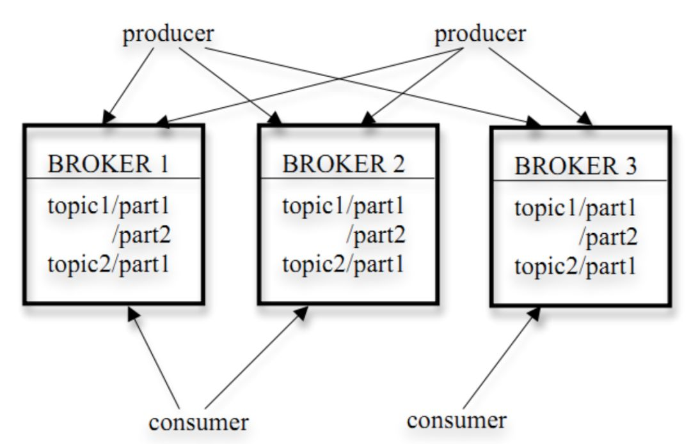
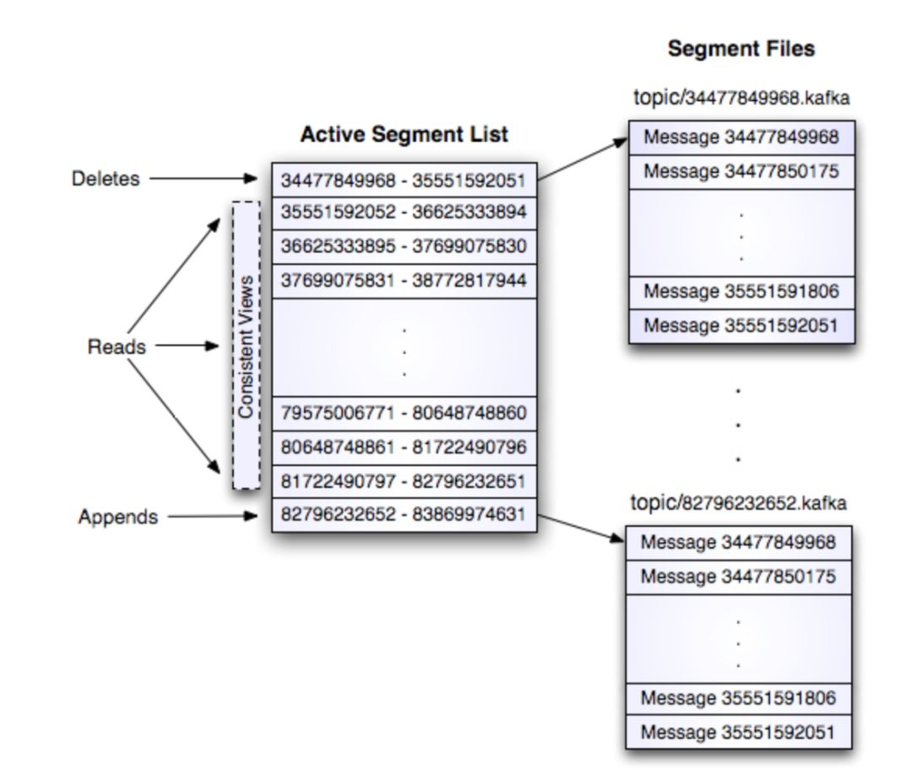

## 安装Kafka
https://kafka.apache.org/quickstart

### STEP 1: GET KAFKA
```
# downlaod
$ wget https://dlcdn.apache.org/kafka/3.3.1/kafka_2.13-3.3.1.tgz
$ tar -xzf kafka_2.13-3.3.1.tgz
$ cd kafka_2.13-3.3.1

```

### STEP 2: START THE KAFKA ENVIRONMENT

#### Kafka with ZooKeeper
```
# Start the ZooKeeper service
$ bin/zookeeper-server-start.sh config/zookeeper.properties
```

Open another terminal session and run:
```
# Start the Kafka broker service
$ bin/kafka-server-start.sh config/server.properties
```

### STEP 3: CREATE A TOPIC TO STORE YOUR EVENTS
```
# create topic
$ bin/kafka-topics.sh --create --topic quickstart-events --bootstrap-server localhost:9092

# details such as the partition count of the new topic
$ bin/kafka-topics.sh --describe --topic quickstart-events --bootstrap-server localhost:9092

```

### STEP 4: WRITE SOME EVENTS INTO THE TOPIC
A Kafka client communicates with the Kafka brokers via the network for writing (or reading) events. Once received, the brokers will store the events in a durable and fault-tolerant manner for as long as you need—even forever.
Run the console producer client to write a few events into your topic. By default, each line you enter will result in a separate event being written to the topic.

```
bin/kafka-console-producer.sh --topic quickstart-events --bootstrap-server localhost:9092
> This is my first event
> This is my second event
```

### STEP 5: READ THE EVENTS
Open another terminal session and run the console consumer client to read the events you just created:
```
$ bin/kafka-console-consumer.sh --topic quickstart-events --from-beginning --bootstrap-server localhost:9092
> This is my first event
> This is my second event
```

## kafka-manager
kafka可视化工具
https://github.com/yahoo/CMAK

- 下载zip包,解压
```
unzip cmak-3.0.0.6.zip
```

- 启动
```
# 修改配置文件 conf/application.conf
# 单个zk
cmak.zkhosts="my.zookeeper.host.com:2181"
# zk集群
cmak.zkhosts="my.zookeeper.host.com:2181,other.zookeeper.host.com:2181"

# 默认端口9000，-Dhttp.port 指定端口
$ bin/cmak -Dconfig.file=/path/to/application.conf -Dhttp.port=8080
```
- 登录管理后台
	- Add Cluster

## kafka 原理

### Kafka架构

- 话题（Topic）：是特定类型的消息流。消息是字节的有效负载（Payload），话题是消息的分类名或种子（Feed）名

- 生产者（Producer）：是能够发布消息到话题的任何对象

- 服务代理（Broker）：已发布的消息保存在一组服务器中，它们被称为代理（Broker）或Kafka集群

- 消费者（Consumer）：可以订阅一个或多个话题，并从Broker拉数据，从而消费这些已发布的消息

  

### Kafka存储策略

- 1）kafka以topic来进行消息管理，每个topic包含多个partition，每个partition对应一个逻辑log，有多个segment组成
- 2）每个segment中存储多条消息（见下图），消息id由其逻辑位置决定，即从消息id可直接定位到消息的存储位置，避免id到位置的额外映射。
- 3）每个part在内存中对应一个index，记录每个segment中的第一条消息偏移。
- 4）发布者发到某个topic的消息会被均匀的分布到多个partition上（或根据用户指定的路由规则进行分布），broker收到发布消息往对应partition的最后一个segment上添加该消息，当某个segment上的消息条数达到配置值或消息发布时间超过阈值时，segment上的消息会被flush到磁盘，只有flush到磁盘上的消息订阅者才能订阅到，segment达到一定的大小后将不会再往该segment写数据，broker会创建新的segment



### Kafka删除策略

- 1）N天前的删除。

- 2）保留最近的MGB数据。

### Kafka broker
与其它消息系统不同，Kafka broker是无状态的。这意味着消费者必须维护已消费的状态信息。这些信息由消费者自己维护，broker完全不管（有offset managerbroker管理）。
-   从代理删除消息变得很棘手，因为代理并不知道消费者是否已经使用了该消息。Kafka创新性地解决了这个问题，它将一个简单的基于时间的SLA应用于保留策略。当消息在代理中超过一定时间后，将会被自动删除。
-   这种创新设计有很大的好处，消费者可以故意倒回到老的偏移量再次消费数据。这违反了队列的常见约定，但被证明是许多消费者的基本特征。

### Kafka Design
目标
1) 高吞吐量来支持高容量的事件流处理
2) 支持从离线系统加载数据
3) 低延迟的消息系统

持久化
1) 依赖文件系统，持久化到本地
2) 数据持久化到log

效率
1) 解决”small IO problem“：
使用”message set“组合消息。
server使用”chunks of messages“写到log。
consumer一次获取大的消息块。

2）解决”byte copying“：

在producer、broker和consumer之间使用统一的binary message format。
使用系统的pagecache。
使用sendfile传输log，避免拷贝。
端到端的批量压缩（End-to-end Batch Compression） 

Kafka支持GZIP和Snappy压缩协议。

### The Producer
#### 负载均衡
1）producer可以自定义发送到哪个partition的路由规则。默认路由规则：hash(key)%numPartitions，如果key为null则随机选择一个partition。
2）自定义路由：如果key是一个user id，可以把同一个user的消息发送到同一个partition，这时consumer就可以从同一个partition读取同一个user的消息。

#### 异步批量发送
批量发送：配置不多于固定消息数目一起发送并且等待时间小于一个固定延迟的数据。

### The Consumer
consumer控制消息的读取

#### Push vs Pull
1)producer push data to broker，consumer pull data from broker
2)consumer pull的优点：consumer自己控制消息的读取速度和数量。
3)consumer pull的缺点：如果broker没有数据，则可能要pull多次忙等待，Kafka可以配置consumer long pull一直等到有数据。

#### Consumer Position
1)大部分消息系统由broker记录哪些消息被消费了，但Kafka不是。
2)Kafka由consumer控制消息的消费，consumer甚至可以回到一个old offset的位置再次消费消息。

#### Message Delivery Semantics
三种：
At most once—Messages may be lost but are never redelivered.
At least once—Messages are never lost but may be redelivered.
Exactly once—this is what people actually want, each message is delivered once and only once.

Producer：
	有个”acks“配置可以控制接收的leader的在什么情况下就回应producer消息写入成功。

Consumer：
- 读取消息，写log，处理消息。如果处理消息失败，log已经写入，则无法再次处理失败的消息，对应”At most once“
- 读取消息，处理消息，写log。如果消息处理成功，写log失败，则消息会被处理两次，对应”At least once“
- 读取消息，同时处理消息并把result和log同时写入。这样保证result和log同时更新或同时失败，对应”Exactly once“
- Kafka默认保证at-least-once delivery，容许用户实现at-most-once语义，exactly-once的实现取决于目的存储系统，kafka提供了读取offset，实现也没有问题

### 复制（Replication）
1）一个partition的复制个数（replication factor）包括这个partition的leader本身。
2）所有对partition的读和写都通过leader。
3）Followers通过pull获取leader上log（message和offset）
4）如果一个follower挂掉、卡住或者同步太慢，leader会把这个follower从”in sync replicas“（ISR）列表中删除。
5）当所有的”in sync replicas“的follower把一个消息写入到自己的log中时，这个消息才被认为是”committed“的。
6）如果针对某个partition的所有复制节点都挂了，Kafka选择最先复活的那个节点作为leader（这个节点不一定在ISR里）。

### 日志压缩（Log Compaction）
1）针对一个topic的partition，压缩使得Kafka至少知道每个key对应的最后一个值。
2）压缩不会重排序消息。
3）消息的offset是不会变的。
4）消息的offset是顺序的。

### Distribution

#### Consumer Offset Tracking
1）High-level consumer记录每个partition所消费的maximum offset，并定期commit到offset manager（broker）。
2）Simple consumer需要手动管理offset。现在的Simple consumer Java API只支持commit offset到zookeeper。

#### Consumers and Consumer Groups
1）consumer注册到zookeeper
2）属于同一个group的consumer（group id一样）平均分配partition，每个partition只会被一个consumer消费
3）当broker或同一个group的其他consumer的状态发生变化的时候，consumer rebalance就会发生

### Zookeeper协调控制
1）管理broker与consumer的动态加入与离开
2）触发负载均衡，当broker或consumer加入或离开时会触发负载均衡算法，使得一个consumer group内的多个consumer的订阅负载平衡
3）维护消费关系及每个partition的消费信息

## in action
### server.properties配置文件参数说明

```
broker.id =0

每一个broker在集群中的唯一表示，要求是正数。当该服务器的IP地址发生改变时，broker.id没有变化，则不会影响consumers的消息情况

log.dirs=/data/kafka-logs

kafka数据的存放地址，多个地址的话用逗号分割,多个目录分布在不同磁盘上可以提高读写性能  /data/kafka-logs-1，/data/kafka-logs-2

port =9092

broker server服务端口

message.max.bytes =6525000

表示消息体的最大大小，单位是字节

num.network.threads =4

broker处理消息的最大线程数，一般情况下数量为cpu核数

num.io.threads =8

broker处理磁盘IO的线程数，数值为cpu核数2倍

background.threads =4

一些后台任务处理的线程数，例如过期消息文件的删除等，一般情况下不需要去做修改

queued.max.requests =500

等待IO线程处理的请求队列最大数，若是等待IO的请求超过这个数值，那么会停止接受外部消息，应该是一种自我保护机制。

host.name

broker的主机地址，若是设置了，那么会绑定到这个地址上，若是没有，会绑定到所有的接口上，并将其中之一发送到ZK，一般不设置

socket.send.buffer.bytes=100*1024

socket的发送缓冲区，socket的调优参数SO_SNDBUFF

socket.receive.buffer.bytes =100*1024

socket的接受缓冲区，socket的调优参数SO_RCVBUFF

socket.request.max.bytes =100*1024*1024

socket请求的最大数值，防止serverOOM，message.max.bytes必然要小于socket.request.max.bytes，会被topic创建时的指定参数覆盖

log.segment.bytes =1024*1024*1024

topic的分区是以一堆segment文件存储的，这个控制每个segment的大小，会被topic创建时的指定参数覆盖

log.roll.hours =24*7

这个参数会在日志segment没有达到log.segment.bytes设置的大小，也会强制新建一个segment会被 topic创建时的指定参数覆盖

log.cleanup.policy = delete

日志清理策略选择有：delete和compact主要针对过期数据的处理，或是日志文件达到限制的额度，会被 topic创建时的指定参数覆盖

log.retention.minutes=300

或

log.retention.hours=24

数据文件保留多长时间， 存储的最大时间超过这个时间会根据log.cleanup.policy设置数据清除策略

log.retention.bytes和log.retention.minutes或log.retention.hours任意一个达到要求，都会执行删除


有2删除数据文件方式：

      按照文件大小删除：log.retention.bytes

  按照2中不同时间粒度删除：分别为分钟，小时

log.retention.bytes=-1

topic每个分区的最大文件大小，一个topic的大小限制 = 分区数*log.retention.bytes。-1没有大小限log.retention.bytes和log.retention.minutes任意一个达到要求，都会执行删除，会被topic创建时的指定参数覆盖

log.retention.check.interval.ms=5minutes

文件大小检查的周期时间，是否处罚 log.cleanup.policy中设置的策略

log.cleaner.enable=false

是否开启日志清理

log.cleaner.threads = 2

日志清理运行的线程数

log.cleaner.io.max.bytes.per.second=None

日志清理时候处理的最大大小

log.cleaner.dedupe.buffer.size=500*1024*1024

日志清理去重时候的缓存空间，在空间允许的情况下，越大越好

log.cleaner.io.buffer.size=512*1024

日志清理时候用到的IO块大小一般不需要修改

log.cleaner.io.buffer.load.factor =0.9

日志清理中hash表的扩大因子一般不需要修改

log.cleaner.backoff.ms =15000

检查是否处罚日志清理的间隔

log.cleaner.min.cleanable.ratio=0.5

日志清理的频率控制，越大意味着更高效的清理，同时会存在一些空间上的浪费，会被topic创建时的指定参数覆盖

log.cleaner.delete.retention.ms =1day

对于压缩的日志保留的最长时间，也是客户端消费消息的最长时间，同log.retention.minutes的区别在于一个控制未压缩数据，一个控制压缩后的数据。会被topic创建时的指定参数覆盖

log.index.size.max.bytes =10*1024*1024

对于segment日志的索引文件大小限制，会被topic创建时的指定参数覆盖

log.index.interval.bytes =4096

当执行一个fetch操作后，需要一定的空间来扫描最近的offset大小，设置越大，代表扫描速度越快，但是也更好内存，一般情况下不需要搭理这个参数

log.flush.interval.messages=None

例如log.flush.interval.messages=1000

表示每当消息记录数达到1000时flush一次数据到磁盘

log文件”sync”到磁盘之前累积的消息条数,因为磁盘IO操作是一个慢操作,但又是一个”数据可靠性"的必要手段,所以此参数的设置,需要在"数据可靠性"与"性能"之间做必要的权衡.如果此值过大,将会导致每次"fsync"的时间较长(IO阻塞),如果此值过小,将会导致"fsync"的次数较多,这也意味着整体的client请求有一定的延迟.物理server故障,将会导致没有fsync的消息丢失.

log.flush.scheduler.interval.ms =3000

检查是否需要固化到硬盘的时间间隔

log.flush.interval.ms = None

例如：log.flush.interval.ms=1000

表示每间隔1000毫秒flush一次数据到磁盘

仅仅通过interval来控制消息的磁盘写入时机,是不足的.此参数用于控制"fsync"的时间间隔,如果消息量始终没有达到阀值,但是离上一次磁盘同步的时间间隔达到阀值,也将触发.

log.delete.delay.ms =60000

文件在索引中清除后保留的时间一般不需要去修改

log.flush.offset.checkpoint.interval.ms =60000

控制上次固化硬盘的时间点，以便于数据恢复一般不需要去修改

auto.create.topics.enable =true

是否允许自动创建topic，若是false，就需要通过命令创建topic

default.replication.factor =1

是否允许自动创建topic，若是false，就需要通过命令创建topic

num.partitions =1

每个topic的分区个数，若是在topic创建时候没有指定的话会被topic创建时的指定参数覆盖


以下是kafka中Leader,replicas配置参数


controller.socket.timeout.ms =30000

partition leader与replicas之间通讯时,socket的超时时间

controller.message.queue.size=10

partition leader与replicas数据同步时,消息的队列尺寸

replica.lag.time.max.ms =10000

replicas响应partition leader的最长等待时间，若是超过这个时间，就将replicas列入ISR(in-sync replicas)，并认为它是死的，不会再加入管理中

replica.lag.max.messages =4000

如果follower落后与leader太多,将会认为此follower[或者说partition relicas]已经失效

##通常,在follower与leader通讯时,因为网络延迟或者链接断开,总会导致replicas中消息同步滞后

##如果消息之后太多,leader将认为此follower网络延迟较大或者消息吞吐能力有限,将会把此replicas迁移

##到其他follower中.

##在broker数量较少,或者网络不足的环境中,建议提高此值.

replica.socket.timeout.ms=30*1000

follower与leader之间的socket超时时间

replica.socket.receive.buffer.bytes=64*1024

leader复制时候的socket缓存大小

replica.fetch.max.bytes =1024*1024

replicas每次获取数据的最大大小

replica.fetch.wait.max.ms =500

replicas同leader之间通信的最大等待时间，失败了会重试

replica.fetch.min.bytes =1

fetch的最小数据尺寸,如果leader中尚未同步的数据不足此值,将会阻塞,直到满足条件

num.replica.fetchers=1

leader进行复制的线程数，增大这个数值会增加follower的IO

replica.high.watermark.checkpoint.interval.ms =5000

每个replica检查是否将最高水位进行固化的频率

controlled.shutdown.enable =false

是否允许控制器关闭broker ,若是设置为true,会关闭所有在这个broker上的leader，并转移到其他broker

controlled.shutdown.max.retries =3

控制器关闭的尝试次数

controlled.shutdown.retry.backoff.ms =5000

每次关闭尝试的时间间隔

leader.imbalance.per.broker.percentage =10

leader的不平衡比例，若是超过这个数值，会对分区进行重新的平衡

leader.imbalance.check.interval.seconds =300

检查leader是否不平衡的时间间隔

offset.metadata.max.bytes

客户端保留offset信息的最大空间大小

kafka中zookeeper参数配置


zookeeper.connect = localhost:2181

zookeeper集群的地址，可以是多个，多个之间用逗号分割 hostname1:port1,hostname2:port2,hostname3:port3

zookeeper.session.timeout.ms=6000

ZooKeeper的最大超时时间，就是心跳的间隔，若是没有反映，那么认为已经死了，不易过大

zookeeper.connection.timeout.ms =6000

ZooKeeper的连接超时时间

zookeeper.sync.time.ms =2000

ZooKeeper集群中leader和follower之间的同步实际那

```