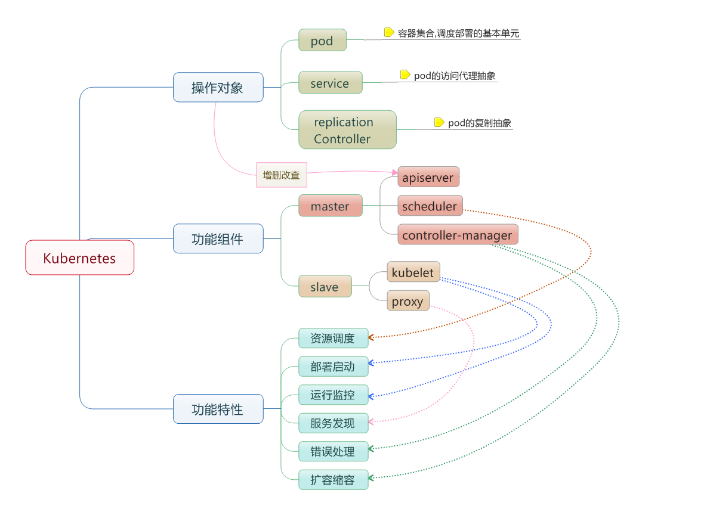

# Kubernetes-Primer
开源容器编排引擎

## 简介
管理跨多个主机的容器，提供基本的部署，维护以及应用伸缩
-   便携：支持公有云，私有云，混合云，以及多种云平台
-   可拓展：模块化，可插拔，支持钩子，可任意组合
-   自修复：自动重调度，自动重启，自动复制

## 基本概念



-  节点（`Node`）：一个节点是一个运行 Kubernetes 中的主机。
-  容器组（`Pod`）：一个 Pod 对应于由若干容器组成的一个容器组，同个组内的容器共享一个存储卷(volume)。
-  容器组生命周期（`pos-states`）：包含所有容器状态集合，包括容器组状态类型，容器组生命周期，事件，重启策略，以及 replication controllers。
-  Replication Controllers：主要负责指定数量的 pod 在同一时间一起运行。
-  服务（`services`）：一个 Kubernetes 服务是容器组逻辑的高级抽象，同时也对外提供访问容器组的策略。
-  卷（`volumes`）：一个卷就是一个目录，容器对其有访问权限。
-  标签（`labels`）：标签是用来连接一组对象的，比如容器组。标签可以被用来组织和选择子对象。
-  接口权限（`accessing_the_api`）：端口，IP 地址和代理的防火墙规则。
-  web 界面（`ux`）：用户可以通过 web 界面操作 Kubernetes。
-  命令行操作（`cli`）：`kubectl`命令。

### Node 节点
在 `Kubernetes` 中，节点是实际工作的点，节点可以是虚拟机或者物理机器，依赖于一个集群环境。每个节点都有一些必要的服务以运行容器组，并且它们都可以通过主节点来管理。必要服务包括 Docker，kubelet 和代理服务。
**Master 负责管理集群**, master 协调集群中的所有活动，例如调度应用程序、维护应用程序的所需状态、扩展应用程序和滚动更新。
每个工作节点都有一个 **kubelet**，它是管理节点并与 Kubernetes Master 节点进行通信的代理。

#### 容器状态
容器状态用来描述节点的当前状态。现在，其中包含三个信息：
  - 主机IP: 主机 IP 需要云平台来查询，`Kubernetes` 把它作为状态的一部分来保存。如果 `Kubernetes` 没有运行在云平台上，节点 ID 就是必需的
  - 节点周期: 通常来说节点有 `Pending`，`Running`，`Terminated` 三个周期
  - 节点状态: 节点的状态主要是用来描述处于 `Running` 的节点。当前可用的有 `NodeReachable` 和 `NodeReady`

#### 节点管理
节点并非 Kubernetes 创建，而是由云平台创建，或者就是物理机器、虚拟机。在 Kubernetes 中，节点仅仅是一条记录，节点创建之后，Kubernetes 会检查其是否可用。在 Kubernetes 中，节点用如下结构保存：

```
{
  "id": "10.1.2.3",
  "kind": "Minion",
  "apiVersion": "v1beta1",
  "resources": {
    "capacity": {
      "cpu": 1000,
      "memory": 1073741824
    },
  },
  "labels": {
    "name": "my-first-k8s-node",
  },
}
```

Kubernetes 校验节点可用依赖于 ID。在当前的版本中，有两个接口可以用来管理节点：节点控制和 Kube 管理。

#### 节点控制
在 Kubernetes 主节点中，节点控制器是用来管理节点的组件。主要包含：
  -   集群范围内节点同步
  -   单节点生命周期管理
节点控制有一个同步轮寻，主要监听所有云平台的虚拟实例，会根据节点状态创建和删除。可以通过 `--node_sync_period`标志来控制该轮寻。如果一个实例已经创建，节点控制将会为其创建一个结构。同样的，如果一个节点被删除，节点控制也会删除该结构。在 Kubernetes 启动时可用通过 `--machines`标记来显示指定节点。同样可以使用 `kubectl` 来一条一条的添加节点，两者是相同的。通过设置 `--sync_nodes=false`标记来禁止集群之间的节点同步，你也可以使用 api/kubectl 命令行来增删节点。

### Pod 容器组
Pod 是一组紧密关联的容器集合，它们共享 PID、IPC、Network 和 UTS namespace，是Kubernetes 调度的基本单位。Pod 的设计理念是支持多个容器在一个 Pod 中共享网络和文件系统，可以通过进程间通信和文件共享这种简单高效的方式组合完成服务。
在 Kubernetes 中，使用的最小单位是容器组，容器组是创建，调度，管理的最小单位。 一个容器组使用相同的 Docker 容器并共享卷（挂载点）。一个容器组是一个特定应用的打包集合，包含一个或多个容器。
在 Kubernetes 中，所有对象都使用 **manifest**（yaml或json）来定义，比如一个简单的 nginx 服务可以定义为 nginx.yaml，它包含一个镜像为 nginx 的容器：
```
apiVersion: v1
kind: Pod
metadata:  
  name: nginx  
  labels:    
    app: nginx
spec:  
  containers:  
  - name: nginx    
    image: nginx    
    ports:    
    - containerPort: 80
```

#### Label
Label 是识别 Kubernetes 对象的标签，以 key/value 的方式附加到对象上（key最长不能超过63字节，value 可以为空，也可以是不超过253字节的字符串）。Label 不提供唯一性，并且实际上经常是很多对象（如Pods）都使用相同的 label 来标志具体的应用。 Label 定义好后其他对象可以使用 Label Selector 来选择一组相同 label 的对象（比如Service 用 label 来选择一组 Pod）。Label Selector支持以下几种方式：
-   等式，如app=nginx和env!=production
-   集合，如env in (production, qa)
-   多个label（它们之间是AND关系），如app=nginx,env=test


#### 资源共享和通信
容器组主要是为了数据共享和它们之间的通信。
在一个容器组中，容器都使用相同的网络地址和端口，可以通过本地网络来相互通信。每个容器组都有独立的 IP，可用通过网络来和其他物理主机或者容器通信。
容器组有一组存储卷（挂载点），主要是为了让容器在重启之后可以不丢失数据。

#### 容器组管理
容器组是一个应用管理和部署的高层次抽象，同时也是一组容器的接口。容器组是部署、水平放缩的最小单位。

#### 容器组的使用
容器组可以通过组合来构建复杂的应用，其本来的意义包含：
  -   内容管理，文件和数据加载以及本地缓存管理等。
  -   日志和检查点备份，压缩，快照等。
  -   监听数据变化，跟踪日志，日志和监控代理，消息发布等。
  -   代理，网桥
  -   控制器，管理，配置以及更新

#### 容器组的生命状态
包括若干状态值：`pending`、`running`、`succeeded`、`failed`

### ReplicaSet
ReplicaSet：是 Pod 副本的抽象，用于解决 Pod 的扩容和伸缩。

### Namespace

Namespace 是对一组资源和对象的抽象集合，比如可以用来将系统内部的对象划分为不同的项目组或用户组。常见的 pods, services,deployments 等都是属于某一个 namespace 的（默认是default），而 Node, PersistentVolumes 等则不属于任何 namespace。

### Deployment
Deployment 确保任意时间都有指定数量的 Pod“副本”在运行。如果为某个 Pod 创建了Deployment 并且指定3个副本，它会创建3个 Pod，并且持续监控它们。如果某个 Pod 不响应，那么 Deployment 会替换它，保持总数为3.
如果之前不响应的 Pod 恢复了，现在就有4个 Pod 了，那么 Deployment 会将其中一个终止保持总数为3。如果在运行中将副本总数改为5，Deployment 会立刻启动2个新 Pod，保证总数为5。Deployment 还支持回滚和滚动升级。
当创建 Deployment 时，需要指定两个东西：
-   Pod模板：用来创建 Pod 副本的模板
-   Label标签：Deployment 需要监控的 Pod 的标签。

### Service
Service 是应用服务的抽象，通过 labels 为应用提供负载均衡和服务发现。匹配 labels 的Pod IP 和端口列表组成 endpoints，由 kube-proxy 负责将服务 IP 负载均衡到这些endpoints 上。
每个 Service 都会自动分配一个 cluster IP（仅在集群内部可访问的虚拟地址）和 DNS 名，其他容器可以通过该地址或 DNS 来访问服务，而不需要了解后端容器的运行。


## 架构设计

Kubernetes 首先是一套分布式系统，由多个节点组成，节点分为两类：一类是属于管理平面的主节点/控制节点（Master Node）；一类是属于运行平面的工作节点（Worker Node）。


### 控制平面 Master
#### Master 主节点服务
Master 节点是 Kubernetes 集群的控制节点，负责整个集群的管理和控制,主节点上需要提供如下的管理服务：
  - kube-apiserver：`apiserver` 是整个系统的对外接口，提供一套 RESTful 的 [Kubernetes API](https://kubernetes.io/zh/docs/concepts/overview/kubernetes-api/)，供客户端和其它组件调用；
  - kube-scheduler：`scheduler` 负责对资源进行调度，分配某个 pod 到某个节点上。是 pluggable 的，意味着很容易选择其它实现方式；
  - kube-controller-manager：`controller-manager` 负责管理控制器，包括 endpoint-controller（刷新服务和 pod 的关联信息）和 replication-controller（维护某个 pod 的复制为配置的数值）

#### Etcd
这里 Etcd 即作为数据后端，又作为消息中间件。
通过 Etcd 来存储所有的主节点上的状态信息，很容易实现主节点的分布式扩展。
组件可以自动的去侦测 Etcd 中的数值变化来获得通知，并且获得更新后的数据来执行相应的操作。

### 工作节点
- Node：Node 节点是 Kubernetes 集群中的工作节点，Node 上的工作负载由 Master 节点分配，工作负载主要是运行容器应用。Node 节点上包含以下组件：
    - kubelet：负责 Pod 的创建、启动、监控、重启、销毁等工作，同时与 Master 节点协作，实现集群管理的基本功能。 kubelet 是工作节点执行操作的 agent，负责具体的容器生命周期管理，根据从数据库中获取的信息来管理容器，并上报 pod 运行状态等；
    - kube-proxy：实现 Kubernetes Service 的通信和负载均衡，运行容器化(Pod)应用。kube-proxy 是一个简单的网络访问代理，同时也是一个 Load Balancer。它负责将访问到某个服务的请求具体分配给工作节点上的 Pod（同一类标签）。


### 核心组件
-   etcd 保存了整个集群的状态，就是一个数据库；
-   apiserver 提供了资源操作的唯一入口，并提供认证、授权、访问控制、API 注册和发现等机制；
-   controller manager 负责维护集群的状态，比如故障检测、自动扩展、滚动更新等；
-   scheduler 负责资源的调度，按照预定的调度策略将 Pod 调度到相应的机器上；
-   kubelet 负责维护容器的生命周期，同时也负责 Volume（CSI）和网络（CNI）的管理；
-   Container runtime 负责镜像管理以及 Pod 和容器的真正运行（CRI）；
-   kube-proxy 负责为 Service 提供 cluster 内部的服务发现和负载均衡；

当然了除了上面的这些核心组件，还有一些推荐的插件：
-   kube-dns 负责为整个集群提供 DNS 服务
-   Ingress Controller 为服务提供外网入口
-   Heapster 提供资源监控
-   Dashboard 提供 GUI

### 组件通信
Kubernetes 多组件之间的通信原理：
-   apiserver 负责 etcd 存储的所有操作，且只有 apiserver 才直接操作 etcd 集群
-   apiserver 对内（集群中的其他组件）和对外（用户）提供统一的 REST API，其他组件均通过 apiserver 进行通信
    -   controller manager、scheduler、kube-proxy 和 kubelet 等均通过 apiserver watch API 监测资源变化情况，并对资源作相应的操作
    -   所有需要更新资源状态的操作均通过 apiserver 的 REST API 进行
-   apiserver 也会直接调用 kubelet API（如 logs, exec, attach 等），默认不校验 kubelet 证书，但可以通过 `--kubelet-certificate-authority` 开启（而 GKE 通过 SSH 隧道保护它们之间的通信）

比如最典型的创建 Pod 的流程：


